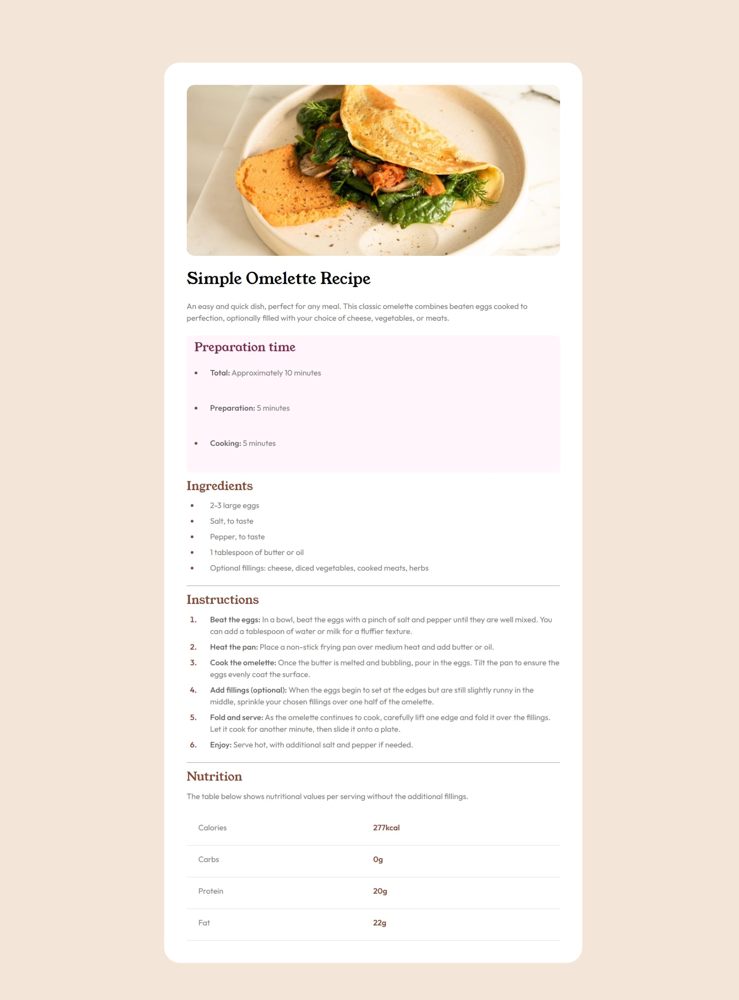

# Frontend Mentor - Recipe page solution

This is a solution to the [Recipe page challenge on Frontend Mentor](https://www.frontendmentor.io/challenges/recipe-page-KiTsR8QQKm). Frontend Mentor challenges help you improve your coding skills by building realistic projects.

## Overview

### Screenshots

### Links

- Live Site URL: [Add live site URL here](https://aditya-en.github.io/frontend-recipe-page/
)

### Built with

- Semantic HTML5 markup
- CSS custom properties
- Flexbox

### What I Learned

Throughout the completion of this Frontend Mentor challenge, I acquired several valuable insights and techniques, which are summarized below:

1. **CSS Custom Properties**: I learned how to utilize CSS custom properties (`--variable-name`) to define and manage color schemes and typography across the project. This approach not only facilitates consistency but also enables easier maintenance and updates.

2. **Efficient Selectors**: I explored methods to select and style HTML elements efficiently without relying on unnecessary classes. By leveraging contextual selectors and pseudo-elements (`::marker`), I improved the maintainability and readability of my CSS code.

3. **Styling Lists**: I discovered various techniques for styling lists, including unordered lists (`ul`) and ordered lists (`ol`). By adjusting properties such as `color`, `padding`, and `::marker`, I achieved visually appealing and well-structured list elements without the need for additional markup.

4. **Responsive Design**: I practiced implementing responsive design principles to ensure optimal viewing experiences across a range of devices and screen sizes. Through media queries (`@media`) and flexible layout techniques, I enhanced the project's adaptability and accessibility.

5. **Typography and Line Height**: I focused on typography details, including font families, weights, and line heights (`line-height`). By fine-tuning these attributes, I improved readability and visual consistency throughout the project.

6. **Semantic HTML**: I emphasized the importance of using semantic HTML elements to enhance accessibility and search engine optimization (SEO). By choosing appropriate tags such as `<main>`, `<h1>`, `
`, and `<ul>`, I ensured clear document structure and improved usability.

7. **Continuous Learning and Problem-Solving**: I encountered various challenges during the project and strengthened my problem-solving skills by researching solutions, consulting documentation, and experimenting with different approaches. This iterative learning process enabled me to overcome obstacles and achieve desired outcomes effectively.

By summarizing these major learnings and reflecting on specific code examples, I reinforce my understanding of frontend development concepts and methodologies while documenting my progress and achievements in this challenge.

## Author

- Frontend Mentor - [@Aditya-en](https://www.frontendmentor.io/profile/Aditya-en)
- Twitter - [@adi\_\_twts](https://www.twitter.com/adi__twts)
